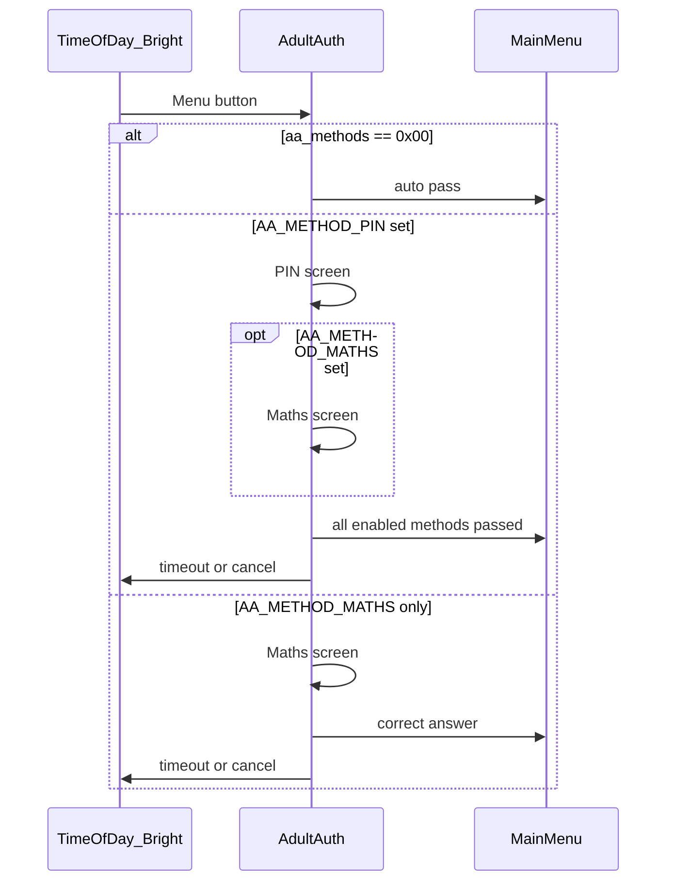
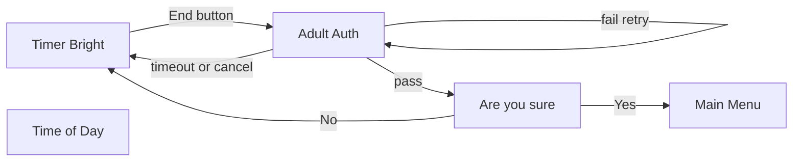

# Adult Authentication (AA)

Gate for restricted actions. Composed of up to **two** screen types; how many are shown is configurable.

**Related docs:** [data_model.md](data_model.md) · [screen_flow.md](screen_flow.md)

---

## Screen types

### 1. PIN entry

- **4 digits**, masked on display
- Compared against stored credential on submit
- Wrong PIN → remain on PIN screen (retry); see session flow

### 2. Maths challenge

- Single-digit addition; see [Maths generation](#maths-generation)
- Wrong answer → new question, remain on maths screen (retry)
- Correct answer → pass maths step

---

## Configuration: `aa_methods`

Stored in NVS as a **`uint8` bitmask**. Each bit enables one method independently.

| Bit | Mask | Constant | Method |
| --- | ---- | -------- | ------ |
| 0 | `0x01` | `AA_METHOD_PIN` | PIN entry |
| 1 | `0x02` | `AA_METHOD_MATHS` | Maths challenge |

Bits 2–7 are reserved (must be written as `0` until defined).

**Factory default:** `aa_methods = 0x00` (no authentication — auto-pass).

### Combinations

| `aa_methods` | Methods enabled | Pass condition |
| ------------ | ----------------- | -------------- |
| `0x00` | None | **Auto-pass** — no adult security |
| `0x01` | PIN | Correct PIN |
| `0x02` | Maths | Correct answer |
| `0x03` | PIN + Maths | PIN first, then maths; **both** must pass |

When both bits are set, screen order is always **PIN → Maths**.

### Settings UI

Toggle each method independently (checkboxes or similar). Examples:

- PIN only: `aa_methods = 0x01`
- Maths only: `aa_methods = 0x02`
- Both: `aa_methods = 0x03`
- Off: `aa_methods = 0x00`

---

## PIN storage and lifecycle

Adult Authentication is **not** high-security — the PIN only discourages children from changing settings. Storing the PIN in plain form in NVS is acceptable.

| Topic | Specification |
| ----- | ------------- |
| Field | `aa_pin` in NVS — see [data_model.md](data_model.md) |
| Storage | 4 decimal digits as a string (e.g. `"1234"`) or equivalent fixed encoding |
| Default PIN | `"0000"` (used when PIN method is enabled) |
| Change PIN | Settings screen (future); enter current PIN then new PIN |
| Length | 4 decimal digits |

---

## Session flow

`timeout_aa_sec` applies on **any** AA screen: no user input → return to **previous screen** (see [screen_flow.md](screen_flow.md)).

### Entry: Time of Day → Main Menu

### Entry: End standalone timer

From [screen_flow.md](screen_flow.md): Timer (Bright) → End → AA → (optional) Are you sure? → Menu or Time of Day.

AA behaviour on timer end uses the same `aa_methods` mask and `timeout_aa_sec` as menu entry.

---

## Runtime: `aa_session` (RAM)

| Field | Type | Description |
| ----- | ---- | ----------- |
| `active` | bool | AA in progress |
| `step` | enum | `none`, `pin`, `maths`, `done` |
| `entry_screen` | enum | Screen to restore on timeout/cancel |
| `last_input_ms` | uint32 | For `timeout_aa_sec` |

---

## Maths generation

Each maths session presents one question at a time: `A + B = ?`

| Rule | Specification |
| ---- | ------------- |
| Operands | `A` and `B` are integers in **0–9** (inclusive) |
| Operator | **Addition only** (`+`) |
| Correct answer | Always a **two-digit** value (**10–18**). Only generate pairs where `10 ≤ A + B ≤ 18` (e.g. `7 + 8`, not `3 + 4`) |
| User input | **2 digits**, zero-padded (e.g. sum `12` → enter `12`; sum `10` → `10`) |
| Wrong answer | Show a **new** question (new random operands meeting the rules above); do not reuse the same question |
| Correct answer | Pass the maths step (or continue to next AA step if PIN is also enabled) |
| Session pass | One correct answer is enough for that maths step; the question does not change until fail or pass |

### Examples

| A | B | Sum | Valid? |
| - | - | --- | ------ |
| 7 | 8 | 15 | Yes |
| 9 | 9 | 18 | Yes |
| 3 | 4 | 7 | No — sum under 10, must not be generated |
| 0 | 9 | 9 | No — sum under 10 |

---

## Out of scope

- NVS key names
- LVGL layout for PIN / maths screens (see existing prototype in `main/ui_screens.cpp`)
- Factory reset / forgotten PIN policy
