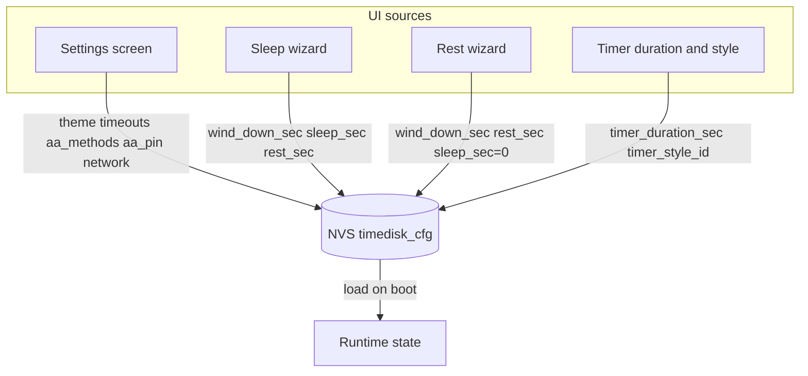
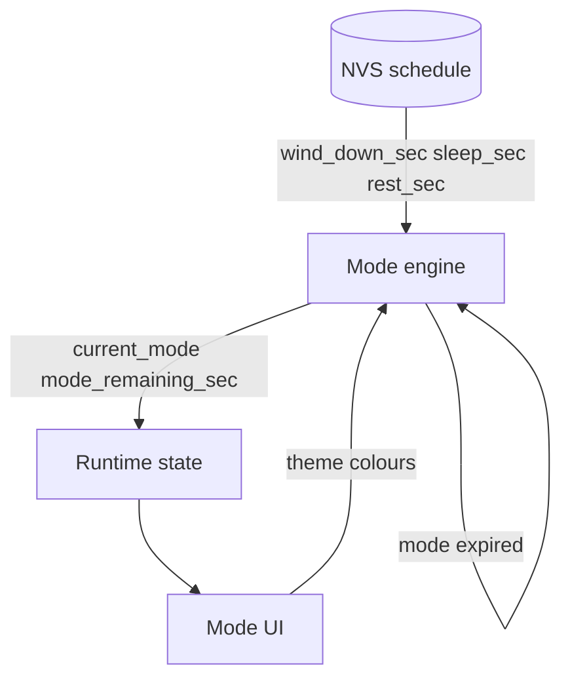
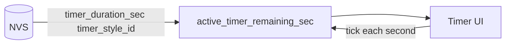

# TimeDisk data flow

How configuration and runtime data move between storage, network, and UI. Complements [screen_flow.md](screen_flow.md) (navigation) with **data** paths.

**Related docs:** [data_model.md](data_model.md) · [mode_flow.md](mode_flow.md) · [adult_authentication.md](adult_authentication.md)

---

## 1. Boot and time sync

```mermaid
flowchart LR
    powerUp([Power Up])
    nvsLoad[NVS load config]
    splash[Splash UI]
    wizardSsid[startup_wizard_ssid]
    wizardPw[startup_wizard_password]
    loading[Loading UI]
    wifi[WiFi connect]
    ntp[NTP sync]
    rtc[System clock]
    todUI[Time of Day Wake UI]

    powerUp --> nvsLoad
    nvsLoad --> splash
    splash -->|"timeout_splash_sec"| wizardSsid
    wizardSsid --> wizardPw
    wizardPw --> loading
    loading --> wifi
    wifi -->|"wifi_ssid wifi_password"| ntp
    ntp -->|"ntp_server"| rtc
    rtc -->|"time_valid"| todUI
```

| From | To | Data | Trigger |
| ---- | -- | ---- | ------- |
| NVS | Boot logic | `wifi_ssid`, `wifi_password` | After splash |
| User | NVS | `wifi_ssid` | startup_wizard_ssid Next |
| User | NVS | `wifi_password` (may be `""`) | startup_wizard_password Next |
| NVS | WiFi stack | `wifi_ssid`, `wifi_password` | After startup wizard / loading |
| NVS | SNTP client | `ntp_server` | WiFi connected |
| NTP server | System clock | UTC timestamp | SNTP success |
| System clock | UI | local time, `time_valid=true` | Time accepted |
| NVS | UI | `timeout_splash_sec` | Boot |

`startup_wizard_ssid` and `startup_wizard_password` are **skipped** when `wifi_ssid` is already set and `wifi_password` is not null — see [data_model.md](data_model.md#startup-wizard-boot-only).

If time is not valid, screen flow may route to Settings / Loading loop — see [screen_flow.md](screen_flow.md) Boot subgraph.

---

## 2. Settings persistence

| From | To | Data | Trigger |
| ---- | -- | ---- | ------- |
| Settings UI | NVS | `ui_primary_color`, `ui_secondary_color`, timeouts, `aa_*`, WiFi, NTP | User saves |
| Sleep wizard | NVS | `wind_down_sec`, `sleep_sec`, `rest_sec` | Wizard complete |
| Rest wizard | NVS | `wind_down_sec`, `rest_sec`, `sleep_sec=0` | Wizard complete |
| Timer setup | NVS | `timer_duration_sec`, `timer_style_id` | User confirms style |
| NVS | RAM | full config struct | Boot, after save |

---

## 3. Mode runtime

| From | To | Data | Trigger |
| ---- | -- | ---- | ------- |
| NVS | Mode engine | schedule durations | Wizard complete or boot |
| Mode engine | RAM | `current_mode`, `mode_remaining_sec` | Tick / transition |
| RAM | UI | mode enum | Mode change |
| NVS | UI | `ui_primary_color`, `ui_secondary_color` | Boot, settings save |
| Mode engine | Mode engine | next non-zero mode | `mode_remaining_sec == 0` |

Skip logic: [mode_flow.md](mode_flow.md).

---

## 4. Standalone timer runtime

Independent of mode engine unless a future policy forbids overlap.

---

## 5. Adult Authentication data

| From | To | Data | Trigger |
| ---- | -- | ---- | ------- |
| NVS | AA module | `aa_methods`, `aa_pin` | Session start |
| User input | AA module | PIN digits / maths answer | Submit |
| AA module | NVS | `aa_pin` | Change PIN in settings |
| AA module | Navigation | pass / fail / timeout | Session end |

Detail: [adult_authentication.md](adult_authentication.md).
