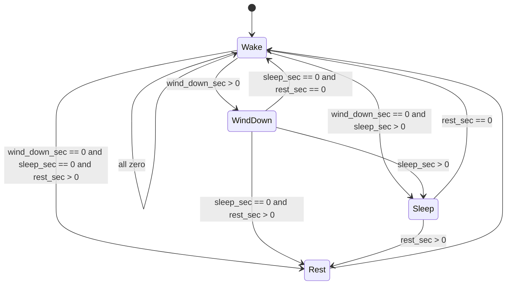

# TimeDisk mode flow

Time-of-day **modes** control which UI is shown on the circular display. Each mode has a **distinct UI**. Durations are configured in seconds — see [data_model.md](data_model.md).

**Related docs:** [data_model.md](data_model.md) · [data_flow.md](data_flow.md) · [screen_flow.md](screen_flow.md)

---

## Modes

| Mode | Enum | Default UI role |
| ---- | ---- | ---------------- |
| **Wake** | `Wake` | Default idle display; start of every cycle |
| **Wind Down** | `WindDown` | Pre-sleep transition UI |
| **Sleep** | `Sleep` | Sleep UI |
| **Rest** | `Rest` | Rest / quiet UI |

---

## Automatic cycle

After the user completes the **Sleep** or **Rest** setup wizard, the device enters **Wake** and immediately begins the automatic sequence:

**Wake → Wind Down → Sleep → Rest → Wake**

Any mode whose duration is **`0` is skipped**. Only modes with `duration > 0` run, in that order.

When a mode’s timer expires, `mode_remaining_sec` is loaded from the next non-skipped mode’s NVS duration. If there is no next mode, transition to **Wake** and clear `cycle_active`.

---

## Skip rules

| Rule | Behaviour |
| ---- | --------- |
| Duration `0` | Mode is never entered |
| Order | Always evaluate **Wind Down → Sleep → Rest** after Wake |
| All zero | Remain in **Wake**; no automatic transitions |

### Examples

| wind_down_sec | sleep_sec | rest_sec | Sequence |
| ------------- | --------- | -------- | -------- |
| 300 | 3600 | 600 | Wake → WindDown → Sleep → Rest → Wake |
| 0 | 3600 | 600 | Wake → Sleep → Rest → Wake |
| 300 | 0 | 600 | Wake → WindDown → Rest → Wake |
| 0 | 0 | 900 | Wake → Rest → Wake |
| 0 | 0 | 0 | Wake only |

---

## Main Menu entry

| User action | NVS fields written | `sleep_sec` after wizard | Cycle starts at |
| ----------- | ------------------ | ------------------------ | --------------- |
| **Sleep** | `wind_down_sec`, `sleep_sec`, `rest_sec` | User value | **Wake** (auto-advance) |
| **Rest** | `wind_down_sec`, `rest_sec` | **Forced to `0`** | **Wake** (auto-advance; Sleep always skipped) |

Setup screens: [screen_flow.md](screen_flow.md) — *Set Sleep Time* and *Set Rest Time* subgraphs.

After the wizard, navigation returns to Time of Day (**Wake** UI) per screen flow (`startToD` → Time of Day Bright).

---

## Standalone timer vs modes

The **countdown timer** (Main Menu → Start Timer) is independent of mode cycling:

- Uses `timer_duration_sec` and `timer_style_id` from [data_model.md](data_model.md)
- Does not change `current_mode` or schedule fields
- Shows a countdown during testing; visuals TBD

A device can run a standalone timer while `current_mode` is **Wake** (or policy TBD if timer + cycle overlap should be forbidden).

---

## UI requirement

Each mode (`Wake`, `WindDown`, `Sleep`, `Rest`) must render a **different** full-screen UI. Theme colours (`ui_primary_color`, `ui_secondary_color`) apply across modes unless a mode overrides them in a future design.

Firmware implements distinct placeholder layouts in `ui_screen_tod.c` (bright/dim share two screen IDs; four mode panels per screen) until wireframes exist.
