# TimeDisk screen flow

```mermaid
flowchart TB
    %% Screens (green)
    menu("Main Menu")
    tod_dim("Time of Day (Dim)")
    tod_bright("Time of Day with Menu Button (Bright)")
    aa_start("Adult Authentication")
    settings("Settings (Main)")
    timer_duration("Timer: Set Duration")
    timer_style("Timer: Set Style")
    timer_bright("Timer with End Button (Bright)")
    timer_dim("Timer (Dim)")
    aa_end("Adult Authentication")
    confirm("Are you sure?")
    sleep_set_wake_up_time("Sleep: Set Wake up Time")
    sleep_rest_rest_end_time("Sleep: Set Rest End Time")
    sleep_set_wind_down_time("Sleep: Set Wind Down Time")
    rest_set_rest_end_time("Rest: Set Rest End Time")
    rest_set_wind_down_time("Rest: Set Wind Down Time")

    %% User actions (blue)
    tap1("Tap Screen")
    btn_press("Menu Button Press")
    cancel_start("Cancel Button")
    tap2("Tap Screen")
    end_btn("End Button")
    cancel_end("Cancel Button")
    confirm_no("No")
    confirm_yes("Yes")
    selected_main_menu_item("Selected Main Menu Item")

    %% User Back Buttons
    back_btn_settings("Back Button")
    back_style("Back Button")
    back_duration("Back Button")
    sleep_set_wake_up_time_back_button("Back Button")
    sleep_rest_rest_end_time_back_button("Back Button")
    sleep_set_wind_down_time_back_button("Back Button")
    rest_set_rest_end_time_back_button("Back Button")
    rest_set_wind_down_time_back_button("Back Button")

    %% User Next Buttons
    ok_duration("Next Button")
    ok_style("Next Button")
    sleep_set_wake_up_time_next_button("Next Button")
    sleep_rest_rest_end_time_next_button("Next Button")
    sleep_set_wind_down_time_next_button("Next Button")
    rest_set_rest_end_time_next_button("Next Button")
    rest_set_wind_down_time_next_button("Next Button")

    %% System events (purple)
    timeout_tod("T.O.D. Dim Timeout")
    fail_start("Fail")
    pass_start("Pass")
    timeout_aa_start("A.A. Timeout")
    dim_timeout("Timer Dim Timeout")
    fail_end("Fail")
    timeout_aa_end("A.A. Timeout")
    pass_end("Pass")
    main_menu_timeout("Main Menu Timeout")

    %% Decision (orange)
    which_main_menu_item_selected{{"Menu Item?"}}

    %% Idle and authentication
    subgraph Time Of Day
        tod_dim --> tap1 --> tod_bright
        tod_bright --> timeout_tod --> tod_dim
        tod_bright --> btn_press --> aa_start
        subgraph Adult Authentication
            aa_start --> fail_start
            aa_start --> timeout_aa_start
            aa_start --> cancel_start
            aa_start --> pass_start
        end
        fail_start --> aa_start
        timeout_aa_start --> tod_bright
        cancel_start --> tod_bright
    end

    %% Menu and settings
    subgraph Main Menu
        menu --> selected_main_menu_item --> which_main_menu_item_selected
        menu --> main_menu_timeout
    end
    which_main_menu_item_selected --> |Settings| settings
    which_main_menu_item_selected --> |Back| tod_bright
    which_main_menu_item_selected --> |Start Timer| timer_duration
    which_main_menu_item_selected --> |Sleep| sleep_set_wake_up_time
    which_main_menu_item_selected --> |Rest| rest_set_rest_end_time
    main_menu_timeout --> tod_bright


    %% Back to Menu
    back_btn_settings --> menu
    sleep_set_wake_up_time_back_button --> menu
    rest_set_rest_end_time_back_button --> menu
    back_duration --> menu
    confirm_yes --> menu
    pass_start --> menu

    %% Settings
    subgraph Settings
        settings --> back_btn_settings
    end

    %% Time of Day Setup
    subgraph Set Sleep Time
        sleep_set_wake_up_time --> sleep_set_wake_up_time_next_button --> sleep_rest_rest_end_time
        sleep_set_wake_up_time --> sleep_set_wake_up_time_back_button
        sleep_rest_rest_end_time --> sleep_rest_rest_end_time_next_button --> sleep_set_wind_down_time
        sleep_rest_rest_end_time --> sleep_rest_rest_end_time_back_button --> sleep_set_wake_up_time
        sleep_set_wind_down_time --> sleep_set_wind_down_time_next_button
        sleep_set_wind_down_time --> sleep_set_wind_down_time_back_button --> sleep_rest_rest_end_time
    end
    sleep_set_wind_down_time_next_button --> tod_bright

    subgraph Set Rest Time
        rest_set_rest_end_time --> rest_set_rest_end_time_next_button --> rest_set_wind_down_time
        rest_set_rest_end_time --> rest_set_rest_end_time_back_button
        rest_set_wind_down_time --> rest_set_wind_down_time_next_button
        rest_set_wind_down_time --> rest_set_wind_down_time_back_button --> rest_set_rest_end_time
    end
    rest_set_wind_down_time_next_button --> tod_bright

    %% Timer setup
    subgraph Timer
        timer_duration --> ok_duration --> timer_style
        timer_duration --> back_duration
        timer_style --> ok_style --> timer_bright
        timer_style --> back_style --> timer_duration

        %% Active timer
        timer_bright --> dim_timeout --> timer_dim
        timer_dim --> tap2 --> timer_bright
        timer_bright --> end_btn --> aa_end

        subgraph Adult Authentication
            aa_end --> fail_end --> aa_end
            aa_end --> timeout_aa_end
            aa_end --> cancel_end
            aa_end --> pass_end
        end
        timeout_aa_end --> timer_bright
        cancel_end --> timer_bright
        pass_end --> confirm
        confirm --> confirm_no --> timer_bright
        confirm --> confirm_yes

    end

    classDef screen fill:#c8e6c9,stroke:#2e7d32,color:#1b5e20
    classDef action fill:#bbdefb,stroke:#1565c0,color:#0d47a1
    classDef event fill:#e1bee7,stroke:#6a1b9a,color:#4a148c
    classDef decision fill:#ffe0b2,stroke:#e65100,color:#bf360c

    class tod_dim,tod_bright,aa_start,menu,settings,timer_duration,timer_style,timer_bright,timer_dim,aa_end,confirm,sleep_set_wake_up_time,sleep_rest_rest_end_time,sleep_set_wind_down_time,rest_set_rest_end_time,rest_set_wind_down_time screen

    rest_set_wind_down_time_next_button("Next Button")
    class tap1,btn_press,cancel_start,ok_duration,back_btn_settings,back_duration,ok_style,back_style,tap2,end_btn,cancel_end,confirm_no,selected_main_menu_item,confirm_yes,sleep_set_wake_up_time_back_button,sleep_rest_rest_end_time_back_button,sleep_set_wind_down_time_back_button,sleep_set_wake_up_time_next_button,sleep_rest_rest_end_time_next_button,sleep_set_wind_down_time_next_button,rest_set_rest_end_time_back_button,rest_set_wind_down_time_back_button,rest_set_rest_end_time_next_button,rest_set_wind_down_time_next_button action

    class timeout_tod,fail_start,pass_start,timeout_aa_start,dim_timeout,fail_end,timeout_aa_end,pass_end,main_menu_timeout event

    class which_main_menu_item_selected decision
```

## Legend

| Color  | Meaning                           |
| ------ | --------------------------------- |
| Green  | Screen                            |
| Blue   | User action or button             |
| Purple | System event or validation result |
| Orange | Decision                          |

## Notes

- **T.o.D.** — time-of-day display (idle).
- **U.A.** — user authentication (PIN / challenge); used when entering the menu from idle and when ending an active timer.
- **menu** ↔ **settings** — settings is reachable from the menu and returns to it.
