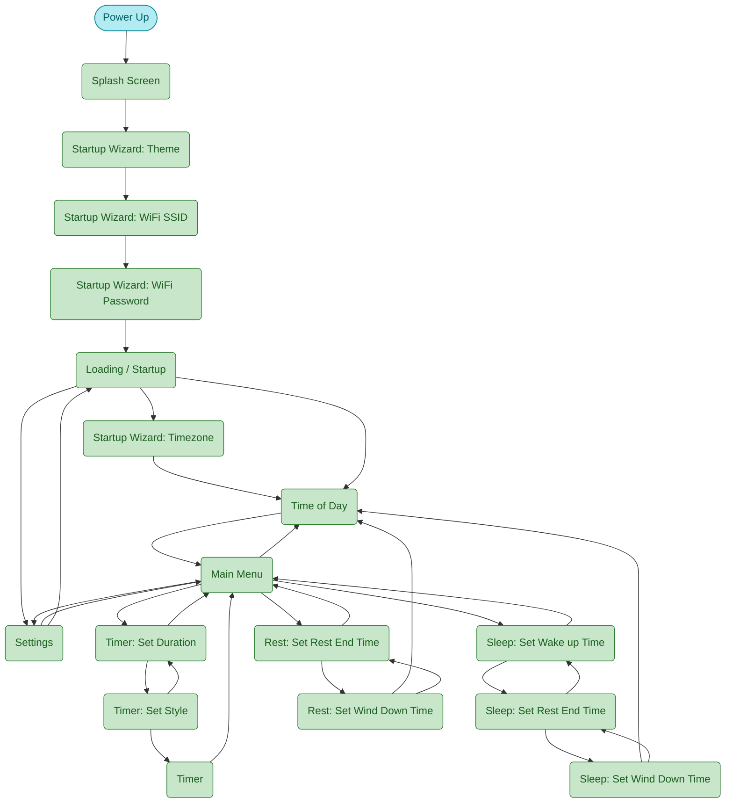

# TimeDisk screen flow (simplified)

Screens only — no actions, events, or decision nodes. See [screen_flow.md](screen_flow.md) for the full diagram (startup WiFi wizards are conditional). Data and modes: [data_model.md](data_model.md) · [mode_flow.md](mode_flow.md).

